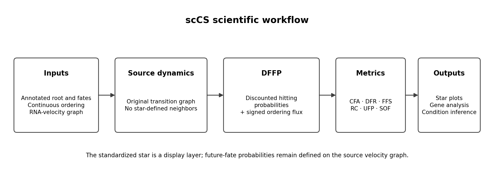
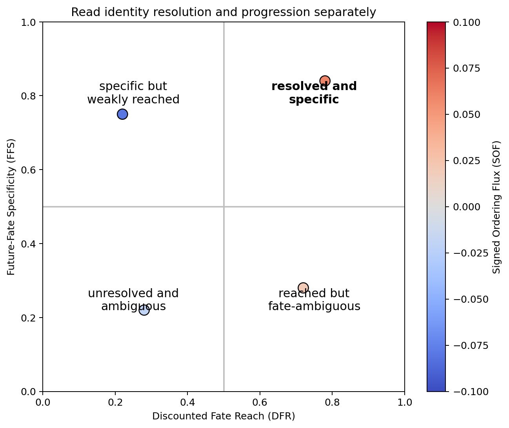

Introduction
============

scCS is a supervised framework for quantifying cell-fate commitment at a
biologically annotated furcation. It is designed for analyses in which the
researcher already has a justified root population, two or more candidate fate
populations, a continuous ordering, and an RNA-velocity transition graph.

What question does scCS answer?
-------------------------------

scCS asks:

   Given a supplied root and candidate fates, which futures are supported by
   the velocity graph, how resolved is each cell's future, and is the cell
   moving forward or backward along the supplied biological ordering?

scCS does not discover topology, choose terminal states, replace RNA velocity,
or claim that every annotated fate is a monotonic outward trajectory. It makes
the supervised assumptions explicit and then quantifies their consequences.

Required inputs
---------------

.. list-table::
   :header-rows: 1
   :widths: 24 38 38

   * - Input
     - Purpose
     - Typical source
   * - RNA-velocity transition graph
     - Defines directed future transitions in the original biological manifold
     - scVelo velocity graph or another row-stochastic transition matrix
   * - Root annotation
     - Defines the shared incoming population
     - Curated cell-type or state annotation
   * - Fate annotations
     - Defines the candidate supervised outcomes
     - Curated terminal or branch populations
   * - Continuous ordering
     - Orders cells, selects late anchors, and defines signed progression
     - Latent time, velocity pseudotime, diffusion pseudotime, CytoTRACE-derived ordering, or experimental time
   * - Conditions and replicates, optional
     - Enables replicate-first PairScorer or MultiScorer inference
     - Genuine biological metadata

Core outputs
------------

The recommended graph-based mode is **Discounted Future-Fate Propagation
(DFFP)**. It separates quantities that are often collapsed into one vague
"commitment score":

* **Conditional Fate Affinity (CFA):** relative future identity among the supplied fates;
* **Discounted Fate Reach (DFR):** probability resolved into any supplied fate;
* **Future-Fate Specificity (FFS):** decisiveness of the conditional fate distribution;
* **Resolved Commitment (RC):** DFR multiplied by FFS;
* **Unresolved Future Probability (UFP):** probability not assigned before geometric stopping;
* **Signed Ordering Flux (SOF):** expected forward or retrograde movement along the ordering.

A cell can have strong CFA for a fate and negative SOF. That means the cell's
future identity remains associated with that fate while its local motion is
retrograde. Turning Alpha, loop-like Epsilon, unusual Delta, and retrograde Gut
are therefore interpretable outcomes rather than errors that must be forced
outward.

Which scorer should I use?
--------------------------

.. list-table::
   :header-rows: 1

   * - Scientific design
     - Scorer
     - Inference level
   * - One dataset or one condition
     - ``SingleScorer``
     - Cell and population summaries
   * - Two independent conditions
     - ``PairScorer``
     - Biological-replicate permutation and bootstrap
   * - Three or more independent conditions
     - ``MultiScorer``
     - Omnibus tests, post-hoc comparisons, and planned contrasts

Which scoring mode should I use?
--------------------------------

``scoring_mode="future_fate"`` is recommended when the main question is future
identity and resolution. It propagates probability on the original velocity
graph and does not manufacture a scientific star-space velocity vector.

``scoring_mode="instantaneous"`` asks where immediate transition-induced motion
points in the supervised geometry. It is useful for local direction and
visualization diagnostics, but it answers a different question.

Recommended workflow
--------------------

#. Inspect the native velocity field in the original manifold.
#. Define and justify the root and candidate fates.
#. Choose and validate a continuous ordering.
#. Run scCS preflight diagnostics.
#. Fit DFFP and inspect CFA, DFR, FFS, RC, UFP, and SOF.
#. Test horizon and anchor sensitivity.
#. Inspect anchor quality and selected-path coverage.
#. Perform downstream gene analysis or replicate-aware condition inference.
#. Export the fitted metrics, metadata, figures, and sensitivity results.

Worked interpretation
---------------------

Suppose a cell has CFA ``[Alpha=0.10, Beta=0.75, Delta=0.05,
Epsilon=0.10]``, DFR ``0.55``, FFS ``0.68``, and SOF ``-0.03``.

* Beta is the dominant supervised future.
* Only 55% of discounted probability reaches a supplied fate, so the future is not fully resolved.
* The fate distribution is fairly specific, but not deterministic.
* RC is ``0.55 × 0.68 = 0.374``.
* Negative SOF indicates retrograde motion along the supplied ordering; it does not erase the Beta future association.

Where to go next
----------------

Read :doc:`mathematical_framework` for the equations, :doc:`quickstart` for the
minimal API workflow, :doc:`method_selection` for the alternatives evaluated,
and the :doc:`tutorials_single`, :doc:`tutorials_pair`, and :doc:`tutorials_multi` guides for complete pancreas and Schwann analyses.
