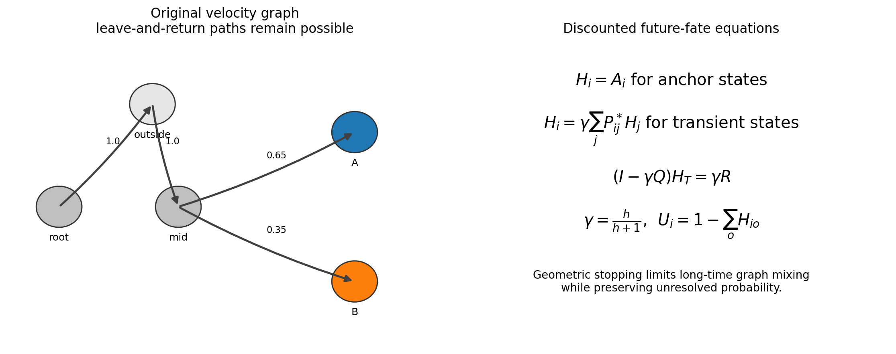

Mathematical framework
======================

Notation
--------

Let :math:`P\in\mathbb{R}^{N\times N}` be a non-negative row-stochastic
transition matrix from the RNA-velocity graph. Let :math:`S` denote the selected
root-plus-fate cells, and let :math:`A\in\{0,1\}^{N\times O}` identify the
anchor states for :math:`O` selected and optional competing outcomes.

Discounted Future-Fate Propagation
----------------------------------

Anchor rows are made absorbing to form :math:`P^*`. Before each transition the
process stops with probability :math:`1-\gamma`, where

.. math::

   \gamma = \frac{h}{h+1}.

The expected number of continued transitions is :math:`\gamma/(1-\gamma)=h`,
so ``effective_horizon=h`` is an interpretable graph scale rather than physical
time.

For an anchor state, the outcome vector equals its anchor indicator. For a
transient state,

.. math::

   H_i = \gamma\sum_j P^*_{ij}H_j.

Partitioning the absorbing chain into transient-to-transient block :math:`Q`
and transient-to-anchor block :math:`R` gives

.. math::

   (I-\gamma Q)H_T = \gamma R.

scCS uses sparse direct solution for modest graphs and sparse fixed-point
iteration for large graphs. The unresolved probability is

.. math::

   U_i = 1-\sum_o H_{io}.

Selected-fate metrics
---------------------

Let :math:`p_{if}` denote the DFFP probability for selected fate :math:`f`.
Discounted Fate Reach is

.. math::

   R_i = \sum_f p_{if}.

Conditional Fate Affinity is defined when :math:`R_i` exceeds the configured
minimum reach:

.. math::

   q_{if} = \frac{p_{if}}{R_i}.

Normalized future-fate entropy and Future-Fate Specificity are

.. math::

   E_i = -\frac{\sum_f q_{if}\log q_{if}}{\log K},
   \qquad
   S_i = 1-E_i.

Resolved Commitment is

.. math::

   C_i = R_iS_i.

CFA describes identity, DFR describes resolution, FFS describes decisiveness,
and RC combines resolution with decisiveness. These values should be reported
separately rather than replacing them with one composite.

Signed Ordering Flux
--------------------

Let :math:`s_i` be the supplied ordering. The one-step selected-path coverage is

.. math::

   c_i = \sum_{j\in S}P_{ij}.

Conditioning transitions on remaining inside the selected furcation gives

.. math::

   \widetilde{P}_{ij}=\frac{P_{ij}}{c_i},\qquad j\in S.

Signed Ordering Flux is

.. math::

   g_i = \sum_{j\in S}\widetilde{P}_{ij}(s_j-s_i).

Positive :math:`g_i` is forward, negative :math:`g_i` is retrograde, and values
near zero may represent stationary, mixed, turning, or loop-like motion. The
support-weighted flux :math:`c_ig_i` is also available when outside-path mass
should reduce the contribution.

Endpoint anchors
----------------

For each fate, scCS selects late cells within that annotated fate using the
ordering quantile and a minimum anchor count. Anchor diagnostics report
transition mass to the same fate, root, other selected fates, and outside the
selected path. Non-sink-like anchors are warnings for interpretation, not
automatic failures.

Instantaneous mode
------------------

For selected star coordinates :math:`y_i` and retained normalized transition
weights :math:`\widetilde{P}_{ij}`, instantaneous mode computes

.. math::

   v_i^{\mathrm{star}}=\sum_{j\in S}\widetilde{P}_{ij}(y_j-y_i).

The fate-directed component is compared with ideal regular-simplex directions.
For :math:`K` fates, these directions satisfy

.. math::

   d_f^\top d_g =
   \begin{cases}
   1, & f=g,\\
   -1/(K-1), & f\ne g.
   \end{cases}

Cosine-softmax affinity is then

.. math::

   a_{if}=\frac{\exp(\beta\cos\theta_{if})}
   {\sum_g\exp(\beta\cos\theta_{ig})}.

This mode measures immediate local direction in the supervised geometry. It is
not the same as DFFP and should not be interpreted as long-term fate
probability.

Condition inference
-------------------

PairScorer and MultiScorer use one pooled scientific model and aggregate cell
metrics within genuine biological replicates. Formal inference permutes
replicate labels, not cell labels. Hierarchical bootstrap resamples replicates
first and cells within replicate second. This preserves the experimental unit
and avoids pseudoreplication.

Parameter interpretation
------------------------

``effective_horizon`` controls graph depth, ``anchor_quantile`` controls how
late endpoint anchors are, ``min_anchor_cells`` prevents tiny anchor sets, and
``min_reach`` controls when CFA is considered defined. A defensible analysis
reports sensitivity across plausible horizons and anchor quantiles.
